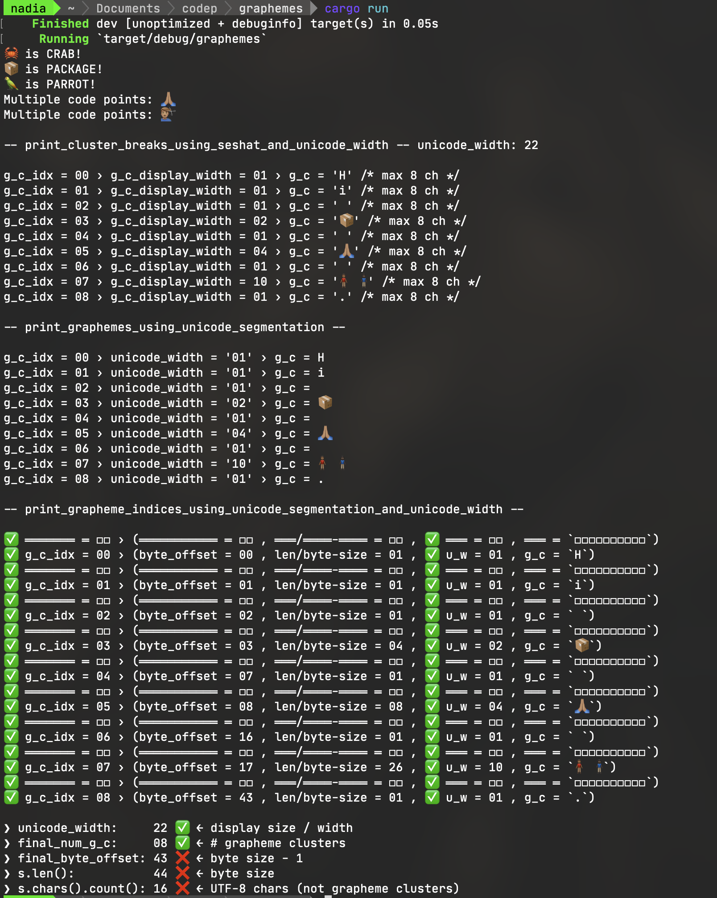
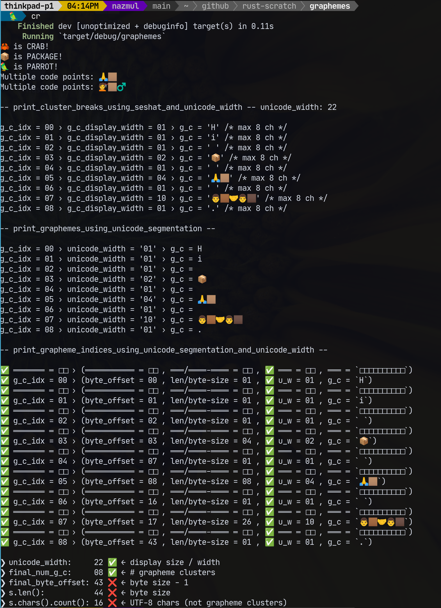

# graphemes

This app simply:

1. prints out a list of graphemes using the `seshat-unicode` and `unicode-segmentation` crates
2. uses `unicode-width` to calculate the display widths of unicode strings

Here is a screenshot from MacOS Monterey (Terminal.app)

Here is a screenshot from PopOS 22.10 (Tilix)

